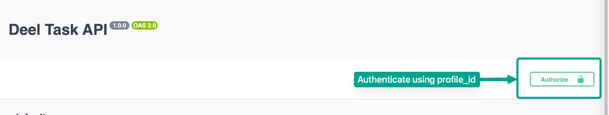

# Deel Task API

## Greetings

Welcome to the Deel Task API project! This API provides functionalities for managing contracts, jobs, and profiles in the Deel system.

- API documentation: https://deel-task.fly.dev/api-docs
- Live Deployement: https://deel-task.fly.dev

## How to Run

### Using npm

1. **Clone the repository:**

   ```bash
   git clone https://github.com/JubayerJoy/deel-task.git
   ```

2. **Navigate to the project directory:**

   ```bash
   cd deel-task
   ```

3. **Install dependencies:**

   ```bash
   npm install
   ```

4. **Seed the SQLite3 database:**

   ```bash
   npm install
   npm run seed
   ```

5. **Run the application:**

   ```bash
   npm start
   ```

### Using Docker

1. **Clone the repository:**

   ```bash
   git clone https://github.com/JubayerJoy/deel-task.git
   ```

2. **Navigate to the project directory:**

   ```bash
   cd deel-task
   ```

3. **Build the Docker image:**

   ```bash
   docker build -t deel-task-api .
   ```

4. **Run the Docker container:**

   ```bash
   docker run -p 3000:3001 deel-task-api
   ```

### Using Docker Compose

1. **Clone the repository:**

   ```bash
   git clone https://github.com/JubayerJoy/deel-task.git
   ```

2. **Navigate to the project directory:**

   ```bash
   cd deel-task
   ```

3. **Run the Docker Compose:**

   ```bash
   docker-compose up -d
   ```

## How to Deploy to Fly

The Deel Task API is deployed on [Fly](https://fly.io/). To deploy your own instance:

1. **Sign up for an account on [Fly](https://fly.io/).**

2. **Install the Fly CLI:**

   ```bash
   npm install -g fly
   ```

3. **Deploy the application:**

   ```bash
   fly deploy
   ```

## Screenshots


**NOTE**: For authentication, select authorize and enter `profile_id` of the intended user.



## Thank You!

Thank you for using the Deel Task API. If you have any questions or feedback, feel free to reach out. Happy coding!
